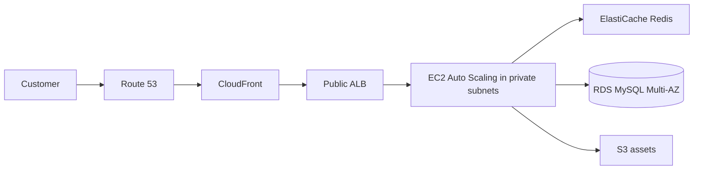

# Project 1 Design - RetailEdge E-Commerce

## Objective

Move the seasonal e-commerce platform from three co-location servers to a highly available AWS three-tier architecture before the 90-day contract renewal.

## Architecture

## Request flow

1. Route 53 resolves the customer domain and CloudFront serves cached static content.
2. Dynamic requests reach the ALB over HTTPS.
3. The ALB sends traffic to healthy EC2 instances across two Availability Zones.
4. The application reads frequently used data from Redis and persistent data from RDS.

## Security and resilience

- Only the ALB is internet-facing.
- App instances accept traffic only from the ALB security group.
- RDS accepts MySQL traffic only from the app security group.
- RDS uses Multi-AZ, backups, encryption, and private database subnets.
- Target tracking scales the ASG from 2 to 10 instances at 60% CPU.
- ALB health checks remove unhealthy instances before serving traffic.

## Failure handling

An instance failure is replaced by the ASG. An Availability Zone failure is handled by the second AZ. An RDS failure uses managed Multi-AZ failover. A bad application deployment is rolled back to the previous image or launch template version.