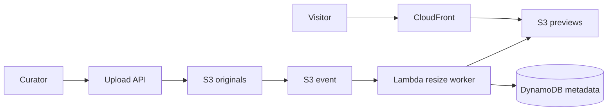

# Project 2 Design - Museum Image Archive

## Objective

Preserve original museum photographs for decades while generating fast, private previews for curators and visitors.

## Architecture

## Data flow

The upload API validates identity, file type, and size before writing to the private originals bucket. An object-created event invokes Lambda. The worker writes multiple preview sizes and updates DynamoDB with processing status. CloudFront serves only approved preview objects.

## Security and resilience

- Originals are private, encrypted, versioned, and transitioned to archival storage by lifecycle policy.
- IAM separates curator upload, worker processing, and visitor preview access.
- DynamoDB uses a key based on the object identifier and supports idempotent updates.
- Failed Lambda events go to a dead-letter queue for replay.
- CloudFront and S3 provide durable, scalable visitor delivery without running web servers.

## Failure handling

Duplicate events are safe because the worker checks the object version and output key. A failed transformation is retried and then placed in the dead-letter queue. If the worker release is defective, disable the event rule, restore the previous Lambda version, and replay originals.