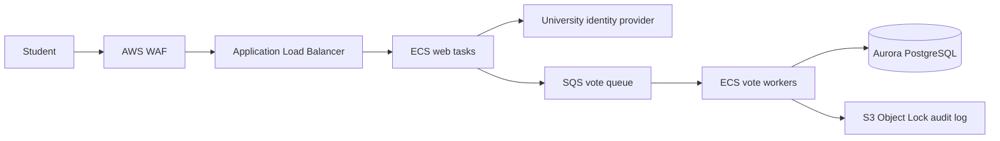

# Project 3 Design - Campus Election Voting

## Objective

Provide a burst-tolerant student election platform that prevents duplicate votes and protects results until polls close.

## Architecture

## Data flow

The student authenticates through the university identity provider. The web service checks election eligibility and submits a signed vote command to SQS. Workers validate the command, enforce one vote per student and election in Aurora, and write an immutable audit record.

## Security and resilience

- WAF blocks common attacks and rate limits suspicious clients.
- Web and worker services run in private subnets; only the ALB is public.
- Aurora is encrypted and accepts connections only from workers.
- SQS decouples the burst of submissions from database writes and has a dead-letter queue.
- S3 Object Lock prevents alteration of audit evidence.

## Failure handling

If workers fail, votes remain in SQS and are retried. If the database is unavailable, the public service reports that submission is pending instead of acknowledging a vote. A bad release is rolled back to the previous ECS task definition; audit records and queued commands remain available.