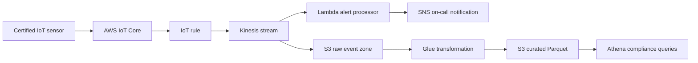

# Project 4 Design - Cold-Chain Logistics Analytics

## Objective

Collect temperature and location events from refrigerated assets, alert operations quickly, and retain evidence for long-term compliance reporting.

## Architecture

## Data flow

Device certificates authenticate sensors. IoT rules route events to Kinesis. The alert processor evaluates temperature thresholds and sends an SNS notification. The same stream writes raw events to S3. Glue creates partitioned Parquet data for Athena queries.

## Security and resilience

- Each device uses a certificate and a policy limited to its own topic.
- Kinesis and S3 use encryption; raw data has a retention and archival policy.
- Event time is stored separately from ingestion time to handle late sensor messages.
- Kinesis provides buffering and replay while S3 remains the durable source of truth.
- Athena workgroups limit query bytes scanned and protect the budget.

## Failure handling

If a device disconnects, its last-known status is monitored and flagged separately from a normal reading. If alert processing fails, events remain in Kinesis for retry. If transformation fails, raw events remain available for replay after the Glue job is corrected.