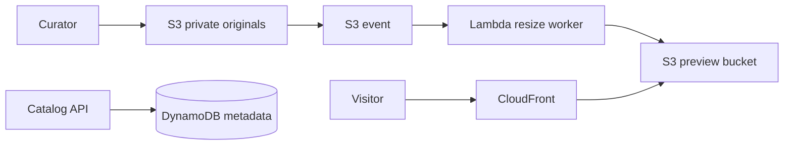

# Project 2 - Museum Image Archive

## Scenario

The City Museum has 2 million historical photographs. Curators upload large TIFF and JPEG files, but visitors need fast web previews in several sizes. The archive must keep originals for 50 years, process uploads without servers running all day, and prevent public access to original files.

**Source code:** [AWS Serverless Image Handler](https://github.com/awslabs/serverless-image-handler)

**Similar example:** [AWS serverless image resizing](https://github.com/aws-samples/serverless-image-resizing)

Clone the primary repository as the application starting point:

```powershell
git clone https://github.com/awslabs/serverless-image-handler.git source
```

## Design



Originals stay private and are readable only by the processing role. Preview objects are delivered through CloudFront. DynamoDB stores the object key, title, creator, date, and processing status. The worker must be idempotent because object events can be delivered more than once.

## Cost report

Estimate S3 storage for originals and previews, S3 requests, Lambda duration, CloudFront transfer, DynamoDB storage and requests, and CloudWatch Logs. Use 40,000 uploads/month, 25 MB average originals, 4 previews per upload, and 500 GB/month of visitor delivery as the initial assumptions. Include monthly cost, 3-year cost, and savings from S3 Glacier lifecycle transitions and CloudFront caching.

## IaC requirements

Terraform must define two private S3 buckets, versioning, lifecycle rules, encryption, event notifications, Lambda, least-privilege IAM, DynamoDB, CloudFront, and alarms for failed processing. Required checks:

```text
terraform fmt -check
terraform init -backend=false
terraform validate
terraform plan
```

## Running plan

```powershell
git clone https://github.com/awslabs/serverless-image-handler.git upstream
Set-Location upstream
```

Pin the upstream commit, deploy to a development account, upload a test photograph, and verify all preview sizes and metadata status. For rollback, disable the upload event, restore the previous Lambda version, and replay failed objects from the original bucket.

## Instructor hints

- Ask: “What prevents a generated preview from triggering the worker again?” Look for separate prefixes or buckets and an explicit explanation.
- Ask students to prove idempotency by sending the same object event twice.
- Remind them that a private original bucket must not be made public just to simplify testing.
- A good cost model includes storage growth and CloudFront transfer, not only Lambda invocations.
- Graduation checkpoint: submit a failed-event replay, a checksum or object-count migration check, and a least-privilege IAM review.

## Project structure - 5 layers

### Layer 1 - Discovery and architecture design

**Scenario:** Museum curators approve the image archive design before implementation.

**Tasks:**

- Draw the upload, processing, metadata, and visitor delivery flow.
- Define image sizes, retention requirements, access roles, and expected upload volume.
- Complete the monthly and 3-year cost estimate.

**Concepts:** Event-driven architecture, serverless design, CDN caching, lifecycle storage.

**Deliverable:** Architecture diagram, design decisions, assumptions, and cost report.

### Layer 2 - Network foundation and security

**Scenario:** Original photographs must never be publicly readable.

**Tasks:**

- Configure private S3 buckets with encryption, versioning, and public-access blocks.
- Define IAM roles for curators, Lambda, CloudFront, and metadata access.
- Add validation for file type, file size, and allowed upload identity.

**Concepts:** Least privilege, data protection, IAM policies, public versus private access.

**Deliverable:** Security design and Terraform resources with no public original bucket.

### Layer 3 - Compute and processing

**Scenario:** Upload volume can increase sharply during a digitization campaign.

**Tasks:**

- Package the Lambda resize worker and configure memory and timeout.
- Make processing idempotent and send failed events to a dead-letter queue.
- Define concurrency limits and alarms for throttles and errors.

**Concepts:** Lambda concurrency, retries, idempotency, asynchronous processing.

**Deliverable:** Working image processor and processing health checks.

### Layer 4 - Data and migration

**Scenario:** Existing catalog metadata and originals must be moved without losing provenance.

**Tasks:**

- Import metadata into DynamoDB with a stable object identifier.
- Copy originals using checksums and verify object counts.
- Define backup, retention, restore, and replay procedures.

**Concepts:** Checksums, versioning, archival storage, recovery point and recovery time objectives.

**Deliverable:** Migration checklist, validation report, and restore test.

### Layer 5 - CI/CD and go-live

**Scenario:** Curators need safe releases without interrupting visitor access.

**Tasks:**

- Test and scan the Lambda package in GitHub Actions.
- Deploy to development, approve production, and publish a versioned Lambda release.
- Monitor processing failures, latency, storage growth, and CloudFront errors.

**Concepts:** Automated delivery, versioned releases, observability, rollback.

**Deliverable:** Pipeline, alarms, go-live checklist, and tested rollback.