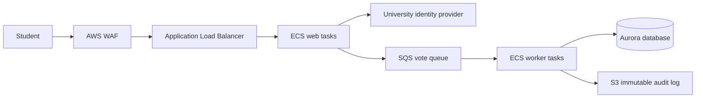

# Project 3 - Campus Election Voting

## Scenario

A university needs a voting platform for student elections. Voting opens for a short period, causing a large traffic spike. A student must vote only once, results must remain private until polls close, and the election team needs a controlled deployment with a quick rollback path.

**Source code:** [Docker example voting app](https://github.com/dockersamples/example-voting-app)

**Similar example:** [Amazon ECS patterns](https://github.com/aws-samples/amazon-ecs-patterns)

Clone the primary repository as the application starting point:

```powershell
git clone https://github.com/dockersamples/example-voting-app.git source
```

## Design



The identity provider supplies the student identity, while the application enforces one vote per election and candidate. SQS separates the public request path from vote persistence. The database is private and encrypted. The audit log is append-only and access is restricted to the election team.

## Cost report

Estimate ECS/Fargate tasks, ALB and WAF, SQS requests, Aurora capacity and storage, S3 audit storage, ECR, and logs. Use 30,000 students, 5,000 votes in the first hour, and a 7-day election window. Compare always-on capacity with scheduled scaling and include a 3-year projection and data retention cost.

## IaC requirements

Terraform must define the VPC, private ECS services, ALB, WAF rules, SQS queue and dead-letter queue, Aurora, S3 Object Lock, ECR, IAM, secrets, alarms, and deployment roles. Required checks:

```text
terraform fmt -check
terraform init -backend=false
terraform validate
terraform plan
```

## Running plan

```powershell
git clone https://github.com/dockersamples/example-voting-app.git upstream
Set-Location upstream
docker compose up --build
```

Run the local application with test identities, submit duplicate votes, and verify the application rejects the second vote. Deploy first to staging, run a load test, then promote the image. Roll back by selecting the previous ECS task definition and preserving the queue for reprocessing.

## Instructor hints

- Ask: “When is a vote accepted?” Students should distinguish an HTTP request being received from a durable database transaction.
- Require a duplicate-vote test, a queue retry test, and a dead-letter queue test.
- Check that the database is private and that student identity data is not written to ordinary application logs.
- A good cost model explains the election traffic spike and why scheduled or autoscaling capacity is appropriate.
- Graduation checkpoint: demonstrate a failed worker, recover the queued vote, and explain how audit records support an investigation.

## Project structure - 5 layers

### Layer 1 - Discovery and architecture design

**Scenario:** The election committee approves the design before the voting window opens.

**Tasks:**

- Draw the student, identity provider, web service, queue, database, and audit flow.
- Define election rules, voter volume, availability target, and result confidentiality.
- Complete the monthly and 3-year cost estimate.

**Concepts:** Stateless services, asynchronous commands, auditability, threat modeling.

**Deliverable:** Architecture diagram, election workflow, risk register, and cost report.

### Layer 2 - Network foundation and security

**Scenario:** Votes and student identity data must be protected from public access.

**Tasks:**

- Create public ALB subnets and private ECS, queue, and database paths.
- Configure WAF rate limiting, security groups, private database access, and encrypted secrets.
- Configure S3 Object Lock for the audit log.

**Concepts:** Network isolation, WAF, identity federation, encryption, immutable records.

**Deliverable:** Network and security design with least-privilege IAM.

### Layer 3 - Compute and scaling

**Scenario:** Thousands of students may submit votes in the first few minutes.

**Tasks:**

- Build and scan the web and worker container images.
- Configure ECS autoscaling and SQS worker concurrency.
- Add health checks and a dead-letter queue for invalid or repeatedly failing commands.

**Concepts:** Containers, horizontal scaling, queue backpressure, health checks.

**Deliverable:** ECS task definitions, scaling policy, and load-test results.

### Layer 4 - Data and integrity

**Scenario:** Every accepted vote must be durable, unique, and auditable.

**Tasks:**

- Store a unique election-and-student constraint in Aurora.
- Persist an append-only audit record for every accepted or rejected command.
- Test backups, failover, duplicate submissions, and queue replay.

**Concepts:** Transactions, idempotency keys, consistency, audit trails, RPO and RTO.

**Deliverable:** Data model, migration or seed plan, integrity tests, and recovery procedure.

### Layer 5 - CI/CD and go-live

**Scenario:** The election team needs a controlled release before polls open and a safe rollback during the election.

**Tasks:**

- Run unit, integration, security, and container tests in GitHub Actions.
- Require approval for production and use rolling ECS deployment.
- Monitor vote errors, queue age, database health, WAF blocks, and service latency.

**Concepts:** Deployment approval, progressive delivery, observability, incident response.

**Deliverable:** CI/CD workflow, election-day checklist, alarms, and rollback drill.