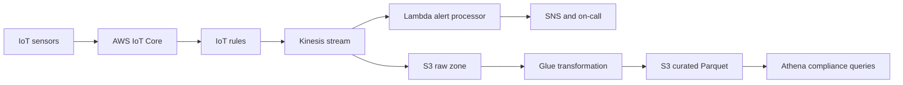

# Project 4 - Cold-Chain Logistics Analytics

## Scenario

A food distributor tracks refrigerated trucks and storage units. Sensors send temperature and location events every minute. Operations staff need near-real-time alerts when food may be unsafe, while analysts need historical data for compliance reports. The system must tolerate intermittent device connectivity and late events.

**Source code:** [AWS Serverless Data Analytics Pipeline](https://github.com/aws-samples/aws-serverless-data-analytics-pipeline)

**Similar example:** [Amazon Kinesis Data Analytics examples](https://github.com/aws-samples/amazon-kinesis-data-analytics-examples)

Clone the primary repository as the application starting point:

```powershell
git clone https://github.com/aws-samples/aws-serverless-data-analytics-pipeline.git source
```

## Design



IoT device certificates authenticate sensors. Kinesis absorbs bursts and preserves ordering per device. The alert processor handles late events using event timestamps, while S3 remains the replayable source of truth. Athena queries only partitioned curated data to control scan costs.

## Cost report

Estimate IoT messages, Kinesis throughput, Lambda duration, S3 raw and curated storage, Glue processing, Athena scans, SNS notifications, and CloudWatch metrics. Use 2,000 sensors, one event per minute, 1 KB events, 2 years of compliance retention, and 1 TB/month queried. Include monthly cost, 3-year cost, and storage lifecycle savings.

## IaC requirements

Terraform must define IoT policies and rules, Kinesis, S3 raw and curated zones, encryption, Glue catalog and jobs, Lambda alerts, SNS, Athena workgroups, IAM, lifecycle rules, and monitoring. Required checks:

```text
terraform fmt -check
terraform init -backend=false
terraform validate
terraform plan
```

## Running plan

```powershell
git clone https://github.com/aws-samples/aws-serverless-data-analytics-pipeline.git upstream
Set-Location upstream
```

Follow the upstream prerequisites, publish sample temperature events, force a threshold breach, and verify the alert and Athena result. Test late and duplicate events. Roll back by disabling the IoT rule, preserving raw events, and reverting the alert or transformation version.

## Instructor hints

- Ask students to distinguish event time from ingestion time and demonstrate a late event.
- Ask: “What is the source of truth if the transformation job fails?” The raw S3 zone should remain replayable.
- Require a duplicate-event test and an alert deduplication strategy so one sensor problem does not page the team repeatedly.
- Check that IoT credentials are device-specific and that Athena queries use partitions to control cost.
- Graduation checkpoint: submit a replay test, a schema-evolution decision, a cost-control report, and an incident runbook for a missing sensor.

## Project structure - 5 layers

### Layer 1 - Discovery and architecture design

**Scenario:** Operations and compliance teams agree on alert timing and reporting requirements.

**Tasks:**

- Draw the sensor, ingestion, stream, alert, raw storage, transformation, and query flow.
- Define sensor volume, event size, alert thresholds, retention, and reporting users.
- Complete the monthly and 3-year cost estimate.

**Concepts:** Streaming architecture, event time, data lake zones, operational analytics.

**Deliverable:** Architecture diagram, event schema, service decisions, and cost report.

### Layer 2 - Network foundation and security

**Scenario:** Only registered sensors may publish events, and compliance data must be protected.

**Tasks:**

- Register device certificates and limit each device policy to its own topic.
- Encrypt Kinesis, S3, Glue, and Athena resources.
- Define IAM roles for ingestion, alerting, transformation, and analysts.

**Concepts:** IoT identity, topic authorization, encryption, data lake access control.

**Deliverable:** Device security model, IAM policy design, and Terraform security resources.

### Layer 3 - Compute and stream processing

**Scenario:** Sensor traffic can burst when many devices reconnect after losing connectivity.

**Tasks:**

- Configure Kinesis capacity, partition keys, retention, and consumer processing.
- Implement threshold alerts with deduplication and event-time handling.
- Add alarms for iterator age, throttles, processing failures, and delivery delay.

**Concepts:** Stream partitioning, backpressure, late events, idempotent consumers.

**Deliverable:** Stream processing design, alert rules, and load-test results.

### Layer 4 - Data and analytics

**Scenario:** Compliance officers must reproduce historical conditions years after an incident.

**Tasks:**

- Store immutable raw events in a date-partitioned S3 zone.
- Transform events into compressed Parquet with a Glue catalog.
- Test replay, late-event correction, retention, and Athena query results.

**Concepts:** Raw and curated zones, schema evolution, partitioning, data replay, governance.

**Deliverable:** Data retention plan, catalog schema, sample queries, and replay procedure.

### Layer 5 - CI/CD and go-live

**Scenario:** Operations needs confidence that a processing change will not hide a temperature breach.

**Tasks:**

- Test schemas, alert thresholds, transformations, and infrastructure in CI.
- Deploy alert and ETL versions independently with approval gates.
- Create dashboards for device health, event lag, alerts, storage, and query cost.

**Concepts:** Data pipeline testing, independent releases, observability, incident response.

**Deliverable:** CI/CD workflow, operational dashboard, go-live checklist, and rollback drill.