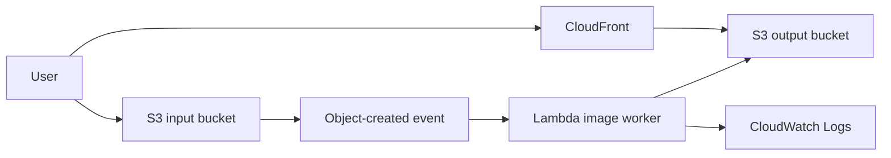
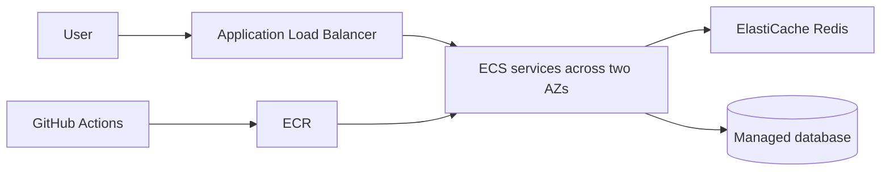
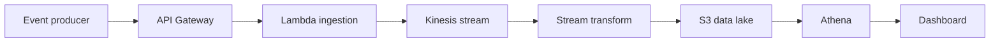

# Cloud Architecture Portfolio Plan

This repository is a README-based plan for four cloud architecture projects. The existing RetailEdge exercise is project 1; the other three projects should be documented in the same format before any implementation begins.

## Required content for every project

1. **Cost report** - assumptions, monthly estimate, three-year view, and optimization options.
2. **System architecture design** - diagram, service choices, data flow, security boundaries, availability, and failure handling.
3. **Infrastructure as Code** - Terraform structure, variables, outputs, security controls, and validation commands.
4. **Project running** - GitHub source repository, setup steps, local run command, deployment steps, smoke test, and rollback notes.

## Four-project roadmap

| Project | Architecture focus | GitHub source to study |
|---|---|---|
| 1. RetailEdge e-commerce migration | AWS three-tier architecture, scaling, RDS, Redis, CI/CD | [AWS three-tier web architecture workshop](https://github.com/aws-samples/aws-three-tier-web-architecture-workshop) |
| 2. Serverless image pipeline | S3 events, Lambda processing, CloudFront | [AWS Serverless Image Handler](https://github.com/awslabs/serverless-image-handler) |
| 3. Container voting platform | Docker, ECS/Fargate, ALB, managed data services | [Docker example voting app](https://github.com/dockersamples/example-voting-app) |
| 4. Event analytics platform | API ingestion, Kinesis, S3 data lake, Athena | [AWS Serverless Data Analytics Pipeline](https://github.com/aws-samples/aws-serverless-data-analytics-pipeline) |

## Source code and similar examples

| Project | Source code to use | Similar example |
|---|---|---|
| RetailEdge | [AWS three-tier web architecture workshop](https://github.com/aws-samples/aws-three-tier-web-architecture-workshop) | [AWS reference architecture examples](https://github.com/aws-samples/aws-refarch-cloudformation) |
| Museum Image Archive | [AWS Serverless Image Handler](https://github.com/awslabs/serverless-image-handler) | [AWS serverless image resizing](https://github.com/aws-samples/serverless-image-resizing) |
| Campus Election Voting | [Docker example voting app](https://github.com/dockersamples/example-voting-app) | [Amazon ECS patterns](https://github.com/aws-samples/amazon-ecs-patterns) |
| Cold-Chain Analytics | [AWS Serverless Data Analytics Pipeline](https://github.com/aws-samples/aws-serverless-data-analytics-pipeline) | [Amazon Kinesis examples](https://github.com/aws-samples/amazon-kinesis-data-analytics-examples) |

Clone the primary source repository for the project, pin the commit used, and use the similar example only for comparison. Read its license and documentation before reusing code.

## Instructor hints and graduation checkpoints

Give students the following hints progressively rather than all at once:

- **Architecture:** Ask what happens when one Availability Zone, instance, database node, or deployment fails. Require a reason for every managed service.
- **Cost:** Ask students to show their usage assumptions before accepting a price. Check that storage, data transfer, backups, logs, and idle capacity are included.
- **IaC:** Ask them to run `terraform fmt`, `terraform validate`, and `terraform plan`. Review security groups, IAM permissions, encryption, state handling, and secret management.
- **Running project:** Require a reproducible setup from a clean machine, a smoke-test result, screenshots or logs, and a rollback demonstration.
- **Graduation evidence:** Collect the architecture diagram, cost spreadsheet, Terraform plan, source commit, test results, incident or failure analysis, and a short presentation explaining trade-offs.

Do not grade students on copying the linked repository. Grade their understanding, traceability of changes, security reasoning, cost assumptions, and ability to recover from failure.

## Separate project README files

- Project 1: this file, the RetailEdge e-commerce migration
- [Project 2 README](README-project-2-image-archive.md)
- [Project 3 README](README-project-3-campus-voting.md)
- [Project 4 README](README-project-4-logistics-analytics.md)

## Architecture design documents

- [Project 1 design](DESIGN-project-1-retailedge.md)
- [Project 2 design](DESIGN-project-2-image-archive.md)
- [Project 3 design](DESIGN-project-3-campus-voting.md)
- [Project 4 design](DESIGN-project-4-logistics-analytics.md)

## README deliverable template

For each project, copy this checklist into its section and complete it:

```text
Project name:
Business problem:
GitHub source and pinned commit:

1. Cost report
  - Usage assumptions:
  - Monthly estimate:
  - Three-year estimate:
  - Cost controls:

2. System architecture design
  - Architecture diagram:
  - Request and data flow:
  - Security boundaries:
  - Availability and recovery:

3. Infrastructure as Code
  - Terraform files:
  - terraform fmt -check:
  - terraform validate:
  - terraform plan:

4. Project running
  - Prerequisites:
  - Local run command:
  - Deployment command:
  - Smoke test:
  - Rollback procedure:
```

Do not commit AWS credentials. Record the exact upstream commit used and verify all costs in the AWS Pricing Calculator before deployment.

---

# RetailEdge Cloud Migration Task — Solutions Architect Simulation
## RetailEdge Inc. — AWS Three-Tier Architecture

---

> **Note to Student:**
> You are not solving a theoretical exercise — you are a **Solutions Architect** hired by a real company.
> Read the brief carefully and think about how you would justify every decision to the CTO.

---

## 📋 The Client Brief — Exactly What They Said to You

> *"We are RetailEdge Inc., a mid-size e-commerce company with 200,000 monthly active users.
> Our platform runs on 3 bare-metal servers in a co-location data center.
> Every Black Friday we go down for 2–3 hours and lose around $80,000 in sales.
> Our deployment takes 4 hours of manual work and we have had 3 production incidents this quarter caused by human error during deployments.
> Our co-lo contract renews in 90 days — this is our window to migrate.
> We need you to design our AWS architecture and deliver the Terraform code to build it."*
>
> — **Sarah Mitchell, CTO — RetailEdge Inc.**

---

## 🎯 Project Overview

| Item | Details |
|------|---------|
| **Company** | RetailEdge Inc. |
| **Current Stack** | 3 bare-metal servers, LAMP (Linux, Apache, MySQL, PHP) |
| **Users** | 200,000 MAU — peak 12,000 concurrent on Black Friday |
| **Pain Points** | Seasonal downtime, 4-hour manual deployments, rising co-lo costs |
| **Your Role** | Lead Solutions Architect |
| **Timeline** | 90 days (before co-lo contract renewal) |
| **Target Architecture** | AWS Three-Tier (Web → Application → Data) |

---

## 🗂️ Project Structure — 5 Layers, Each Builds on the Last

---

### 🔵 Layer 1 — Discovery & Architecture Design
**Weeks 1–2**

#### The Scenario
Sarah has scheduled your kick-off meeting. Before approving the budget, she wants to understand exactly what you plan to build and why. You need to present an **Architecture Design Document** with a diagram and a justification for every decision you make.

#### Your Tasks

- [ ] **Task 1.1** — Draw the Three-Tier AWS Architecture using the following services:
  - **Tier 1 (Web):** CloudFront, Route 53, Application Load Balancer
  - **Tier 2 (Application):** EC2 Auto Scaling Group (min: 2, max: 10)
  - **Tier 3 (Data):** RDS MySQL Multi-AZ, ElastiCache Redis, S3

- [ ] **Task 1.2** — Choose a **Migration Strategy** for each component and justify your choice:
| Component | Strategy Options | Your Choice | Justification |
|---|---|---|---|

- [ ] **Task 1.3** — Produce a TCO (Total Cost of Ownership) comparison:
  - Current on-premises cost: **$18,000/year**
  - Use the [AWS Pricing Calculator](https://calculator.aws) to estimate the AWS cost
  - Build a **3-year projection** comparing both options

- **AWS Monthly Cost:** $166.65

#### Concepts Covered
- AWS Well-Architected Framework (5 Pillars)
- Three-Tier Architecture pattern
- The 6 Rs of Cloud Migration
- TCO Analysis

#### Deliverable
A PDF or draw.io file containing the Architecture Diagram + the strategy justification table + the TCO comparison


---

### 🟣 Layer 2 — Network Foundation & Security
**Weeks 3–4**

#### The Scenario
The CTO approved your design. Now Sarah tells you:
> *"Before any server launches, I need to see the network locked down. We had a security audit last year and the auditors were not happy. No machine should be able to talk to another machine unless it absolutely has to."*

You need to provision the VPC with Terraform and enforce strict isolation between every tier.

#### Your Tasks

- [ ] **Task 2.1** — Edit `main.tf` from the starter code and complete the missing CIDR ranges:

```
VPC CIDR:              10.0.0.0/16
Public Subnets:        10.0.1.0/24  (AZ-a)  |  ___________ (AZ-b)   ← complete this
Private Subnets:       10.0.11.0/24 (AZ-a)  |  ___________ (AZ-b)   ← complete this
Database Subnets:      10.0.21.0/24 (AZ-a)  |  ___________ (AZ-b)   ← complete this
```

- [ ] **Task 2.2** — Write the missing Security Groups in `security_groups.tf`:
  - `alb_sg` — Allow HTTPS (443) inbound from the internet only
  - `app_sg` — Allow port 8080 from `alb_sg` only, not from the internet directly
  - `rds_sg` — Allow port 3306 from `app_sg` only

- [ ] **Task 2.3** — Write a short explanation answering the following for Sarah:
  - Why does the Database Subnet have no route to the Internet Gateway?
  - What is the difference between Security Groups and NACLs?

#### Concepts Covered
- VPC Design: Public / Private / Isolated Subnet layout
- Security Groups (Stateful) vs NACLs (Stateless)
- Principle of Least Privilege in networking
- Terraform resources: `aws_vpc`, `aws_subnet`, `aws_security_group`

#### Deliverable
Completed `main.tf` + `security_groups.tf` — run `terraform plan` and confirm 0 errors

---

### 🟢 Layer 3 — Compute & Auto Scaling
**Weeks 5–7**

#### The Scenario
Sarah comes to you with a direct question:
> *"We crashed last Black Friday with 8,000 concurrent users. This year we expect 15,000. Can you guarantee we will not go down?"*

You need to build the Auto Scaling Group and prove to her that the system can scale automatically under load.

#### Your Tasks

- [ ] **Task 3.1** — Complete `compute.tf`:
  - Define the `aws_launch_template` using `var.golden_ami_id`
  - Set the ASG: min=2, max=10, desired=2
  - Enable `instance_refresh` with `min_healthy_percentage = 90`

- [ ] **Task 3.2** — Write the Scaling Policy:
  - Use Target Tracking on `ASGAverageCPUUtilization`
  - Target value: **60%**

- [ ] **Task 3.3** — Answer the following questions for Sarah:
  - If CPU hits 60% on one instance, what happens next — step by step?
  - When does a new instance start receiving traffic? Why not immediately?
  - Why did we choose `min=2` instead of `min=1`?

- [ ] **Task 3.4 — Bonus** — Write a Scheduled Scaling Action that increases desired capacity to 6 every Friday at 8:00 PM UTC

#### Concepts Covered
- Launch Templates and the Golden AMI pattern
- Auto Scaling: Target Tracking / Step Scaling / Scheduled Scaling
- ALB Health Checks and Rolling Instance Refresh
- High Availability: Multi-AZ compute placement

#### Deliverable
Completed `compute.tf` + answers to Task 3.3 written in a `notes.md` file

---

### 🔴 Layer 4 — Data Layer & Migration
**Weeks 8–10**

#### The Scenario
This is the most critical part. Sarah is worried:
> *"Our database has 8 years of customer and order data. I cannot lose a single record. And I cannot take the site down for more than 30 minutes for the migration."*

You need to plan and execute the database migration using DMS with zero data loss and minimal downtime.

#### Your Tasks

- [ ] **Task 4.1** — Complete `data.tf`:
  - Define `aws_db_instance` with: Multi-AZ=true, storage_encrypted=true, backup_retention=7
  - Define `aws_elasticache_replication_group` with: 2 nodes, encryption enabled on both at-rest and in-transit

- [ ] **Task 4.2** — Write the Migration Cutover Plan:

```
Phase 1 — Full Load    DMS copies all existing data to RDS   (estimated time: ___ hours)
Phase 2 — CDC          DMS tracks and replicates live changes
Phase 3 — Cutover      When replication lag < ___ seconds, what exactly do you do?
Phase 4 — Rollback     If a problem is discovered within 48 hours, what is your rollback plan?
```

- [ ] **Task 4.3** — Answer the following:
  - What is the difference between RPO and RTO?
  - Based on the configuration you built, what are the expected RPO and RTO values?

- [ ] **Task 4.4 — Bonus** — Why did we add ElastiCache alongside RDS? Draw a simple diagram showing the Cache Hit and Cache Miss flow

#### Concepts Covered
- RDS Multi-AZ: Synchronous replication and automatic failover
- AWS DMS: Full Load + CDC migration pattern
- ElastiCache: Write-through / Read-through caching strategy
- RPO / RTO / Backup and recovery strategy

#### Deliverable
Completed `data.tf` + a `migration_plan.md` file with the full cutover plan

---

### 🟡 Layer 5 — CI/CD Pipeline & Go-Live
**Weeks 11–12**

#### The Scenario
Everything is running in staging. Sarah calls you:
> *"Our engineers told me our current deployment is 4 hours of manual SSH and file copying. I want deployments to be automatic, safe, and I want to know when something is wrong before my customers do."*

You need to build the CI/CD pipeline and configure monitoring before the live cutover.

#### Your Tasks

- [ ] **Task 5.1** — Complete `.github/workflows/deploy.yml`:
  - **Test stage** — runs unit tests
  - **Build stage** — builds the Docker image and pushes it to ECR
  - **Deploy stage** — requires **manual approval** before deploying to production
  - If deployment fails, **auto-rollback** must be triggered automatically

- [ ] **Task 5.2** — Define the required CloudWatch Alarms:

  | Alarm Name | Metric | Threshold | Action |
  |------------|--------|-----------|--------|
  | High Latency | ALB P95 Latency | > 800ms for 5 minutes | ? |
  | High Error Rate | ALB 5xx Rate | > 1% | ? |
  | DB CPU Spike | RDS CPUUtilization | > 80% | ? |
  | Low Cache Hit Rate | ElastiCache Hit Rate | < 70% | ? |

- [ ] **Task 5.3** — Build your Go-Live Checklist:
  - What are the 5 things you must verify before flipping the DNS?
  - How do you perform the DNS cutover safely? (Hint: Route 53 Weighted Routing)

- [ ] **Task 5.4 — Bonus** — Sarah asks: *"How much will we save compared to our old setup?"*
  Write a short Cost Optimization report covering:
  - Savings Plans or Reserved Instances for RDS
  - S3 Intelligent-Tiering for static assets
  - AWS Compute Optimizer recommendations

#### Concepts Covered
- GitHub Actions: Stages, OIDC Authentication (no static AWS keys stored)
- AWS CodeDeploy: Rolling Deployment + Auto Rollback
- CloudWatch: Dashboards, Alarms, and SNS Notifications
- Cost Optimization: Savings Plans, Reserved Instances, Intelligent-Tiering

#### Deliverable
Completed `deploy.yml` + `go_live_checklist.md` + the Alarms table filled in

---

## 📁 Starter Code Structure

```
code :: https://github.com/aws-samples/aws-three-tier-web-architecture-workshop
retailedge-aws/
├── terraform/
│   ├── main.tf              ← Layer 2: VPC  (incomplete — you complete it)
│   ├── security_groups.tf   ← Layer 2: Security Groups  (incomplete — you complete it)
│   ├── compute.tf           ← Layer 3: Auto Scaling  (incomplete — you complete it)
│   ├── data.tf              ← Layer 4: RDS + Redis  (incomplete — you complete it)
│   ├── variables.tf         ← Variables  (complete — do not modify)
│   └── outputs.tf           ← Outputs  (complete — do not modify)
├── .github/
│   └── workflows/
│       └── deploy.yml       ← Layer 5: CI/CD Pipeline  (incomplete — you complete it)

└── README.md
```

**Files marked "complete — do not modify"** are provided so you have a working application to deploy. Focus your effort on the files marked incomplete.

---

## 📊 Grading Rubric

| Layer | Points | What Is Evaluated |
|-------|--------|-------------------|
| Layer 1 — Design | 20 | Diagram correctness + quality of TCO and strategy justifications |
| Layer 2 — Network | 20 | Correct CIDR blocks + least-privilege Security Groups + written explanation |
| Layer 3 — Compute | 20 | Correct ASG configuration + scaling policy + Q&A answers |
| Layer 4 — Data | 20 | RDS Multi-AZ settings + complete DMS cutover plan + RPO/RTO answer |
| Layer 5 — CI/CD | 20 | Working pipeline + alarms table + go-live checklist |
| **Total** | **100** | |

**Bonus Tasks:** Each correct bonus task = +5 extra points

---

## 🚫 Rules & Academic Integrity

1. **Work independently** on the Terraform code — do not copy from the internet without understanding what each line does
2. **Analytical questions** (Tasks 1.2, 3.3, 4.3) must reflect your own reasoning — there is no single right answer, the quality of your thinking is what is graded
3. **No real AWS account required** — `terraform plan` output is sufficient for grading; you do not need to apply
4. **Never commit real AWS credentials** into any file

---

## 📚 Resources

| Topic | Link |
|-------|------|
| AWS Well-Architected Framework | https://aws.amazon.com/architecture/well-architected/ |
| Terraform AWS Provider Docs | https://registry.terraform.io/providers/hashicorp/aws/latest |
| AWS VPC User Guide | https://docs.aws.amazon.com/vpc/latest/userguide/ |
| RDS Multi-AZ Documentation | https://aws.amazon.com/rds/features/multi-az/ |
| AWS Database Migration Service | https://aws.amazon.com/dms/ |
| GitHub Actions Documentation | https://docs.github.com/en/actions |
| AWS Pricing Calculator | https://calculator.aws |

---

*This task is designed as a Solutions Architect simulation. RetailEdge Inc. is a fictional company.*
*Think like an architect, not just a developer — every decision needs a reason.* 🏗️

---

# Project 2 - Serverless Image Pipeline

**GitHub source:** [AWS Serverless Image Handler](https://github.com/awslabs/serverless-image-handler)

## Business problem

Build an image upload service that stores originals durably and creates thumbnails asynchronously without paying for idle servers.

## Cost report

Estimate S3 storage and requests, Lambda duration, CloudFront transfer, and CloudWatch Logs for 100,000 uploads/month, 2 MB average originals, three thumbnails per image, and 100 GB/month of delivery. Document monthly cost, a 3-year projection, and savings from lifecycle rules, Intelligent-Tiering, caching, log retention, and budgets.

## Architecture design



Keep input and output prefixes separate, make processing idempotent, validate size and content type, encrypt both buckets, and keep them private behind CloudFront.

## IaC

Terraform must define the buckets, public-access blocks, lifecycle rules, event notification, Lambda, least-privilege IAM, CloudFront, and alarms. Run `terraform fmt -check`, `terraform init -backend=false`, `terraform validate`, and `terraform plan`.

## Running

```powershell
git clone https://github.com/awslabs/serverless-image-handler.git upstream
Set-Location upstream
```

Pin the upstream commit, follow its deployment guide, upload a sample image, and verify the thumbnail. Roll back by disabling the event and restoring the previous Lambda version.

---

# Project 3 - Container Voting Platform

**GitHub source:** [Docker example voting app](https://github.com/dockersamples/example-voting-app)

## Business problem

Run a voting service that handles traffic bursts, deploys consistently, and recovers quickly when a container fails.

## Cost report

Estimate ECS/Fargate tasks, the Application Load Balancer, ECR storage, Redis, the managed database, logs, and data transfer. Provide monthly and 3-year totals. Reduce cost with autoscaling, small staging tasks, ECR lifecycle rules, log retention, and reserved capacity only after usage is stable.

## Architecture design



Put tasks in private subnets, expose only the ALB, use immutable ECR tags, health checks, encrypted secrets, and a previous task definition for rollback.

## IaC

Terraform must define the VPC, subnets, ALB, ECS cluster and services, ECR, IAM, security groups, logs, Redis, and database. Run `terraform fmt -check`, `terraform init -backend=false`, `terraform validate`, and `terraform plan`. No data service may be internet-facing.

## Running

```powershell
git clone https://github.com/dockersamples/example-voting-app.git upstream
Set-Location upstream
docker compose up --build
```

Submit a vote and verify the result. For AWS, build, scan, push, deploy to staging, then promote the tested task definition. Roll back by selecting the previous ECS task definition.

---

# Project 4 - Event Analytics Platform

**GitHub source:** [AWS Serverless Data Analytics Pipeline](https://github.com/aws-samples/aws-serverless-data-analytics-pipeline)

## Business problem

Ingest application events, retain raw data for replay, and provide analytics without operating a permanent analytics server.

## Cost report

Estimate API Gateway, Lambda, Kinesis, S3, transformation, Athena, CloudWatch, and dashboard costs for 10 million events/day, 1 KB average events, 30-day raw retention, and 2 TB/month queried. Document monthly and 3-year totals. Reduce cost with partitions, Parquet, file compaction, lifecycle rules, and Athena scan limits.

## Architecture design



Authenticate producers, validate schemas, encrypt the stream and buckets, partition curated data by date, retain raw data for replay, and alarm on errors, iterator age, throttles, and query spend.

## IaC

Terraform must define the API, Lambda IAM, Kinesis, raw and curated S3 zones, encryption, lifecycle, Glue catalog, Athena workgroup, alarms, and dashboard permissions. Run `terraform fmt -check`, `terraform init -backend=false`, `terraform validate`, and `terraform plan`.

## Running

```powershell
git clone https://github.com/aws-samples/aws-serverless-data-analytics-pipeline.git upstream
Set-Location upstream
```

Pin the source commit, follow its prerequisites, publish a sample event, and verify query output. Test replay from one raw partition. Roll back by disabling ingestion, preserving raw data, and reverting the transform or consumer.
